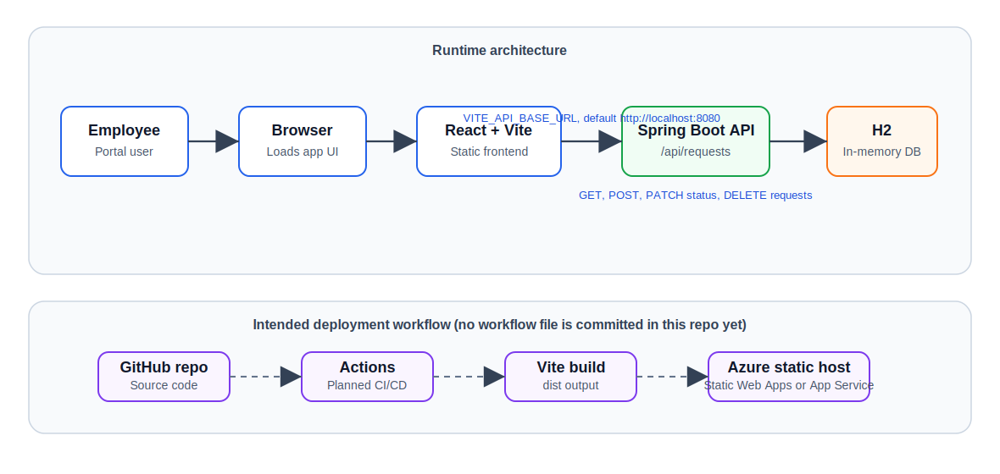

# Employee Service Frontend AZAPP

React + Vite frontend for the Employee Service Request Portal. The application lets employees create service requests and lets support users update request status or delete requests.

This repository is designed for practicing GitHub Actions CI/CD with a frontend build and Azure-style deployment flow.

## Architecture



The deployment lane shows the intended GitHub Actions and Azure flow. No workflow file is committed in this frontend repository yet.

## Tech Stack

- React 18
- Vite 5
- JavaScript
- CSS
- Fetch API
- GitHub Actions
- Azure Static Web Apps or Azure App Service target deployment

## Features

- Create employee service requests
- View all requests from the backend
- Update request status
- Delete requests
- Loading and empty states
- Error handling for backend connection issues
- Configurable backend API URL through environment variables

## Backend Integration

By default, the frontend connects to:

```text
http://localhost:8080
```

The API base URL can be changed with:

```text
VITE_API_BASE_URL=http://localhost:8080
```

Example `.env` file:

```text
VITE_API_BASE_URL=http://localhost:8080
```

## Local Development

Install dependencies:

```powershell
npm install
```

Start the development server:

```powershell
npm run dev
```

Build for production:

```powershell
npm run build
```

The Vite dev server normally runs on:

```text
http://localhost:5173
```

## Application Flow

1. The page loads and calls the backend to fetch existing requests.
2. A user submits employee name, title, and description.
3. The frontend sends a `POST` request to the backend.
4. The backend stores the request and returns the saved item.
5. The frontend refreshes the list.
6. Users can update status or delete requests from the list.

## GitHub Actions Practice Ideas

Recommended workflow stages:

1. Checkout repository
2. Set up Node.js
3. Install dependencies with `npm install`
4. Run `npm run build`
5. Upload the `dist` folder as an artifact
6. Deploy to Azure Static Web Apps or Azure App Service

Example workflow file location:

```text
.github/workflows/frontend-ci-cd.yml
```

## Related Repository

Backend repository:

```text
employee-service-backend-azapp
```
